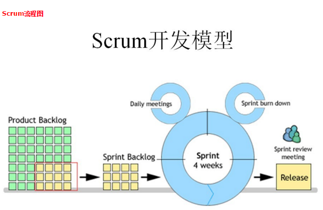
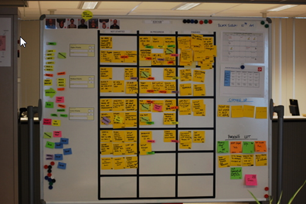
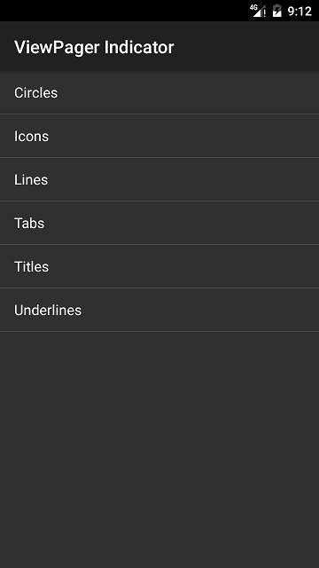
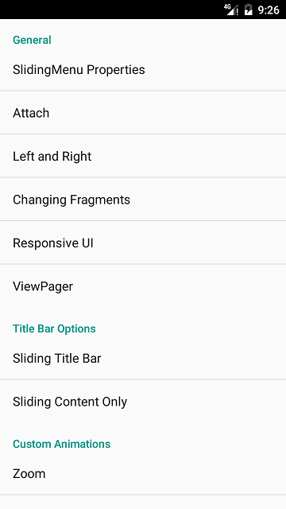

# 敏捷开发 #
>敏捷开发(Agile Development)是一种以人为核心、迭代、循序渐进的开发方法。

1. 以人为核心：注重团队成员之间面对面的交流，尽量减少文档
2. 迭代：把一个复杂且开发周期很长的开发任务，分解成很多小周期可完成的任务，每个小周期都能生产或开发出一个可交付的软件产品, 每个小周期就是一次迭代

## Scrum开发流程 ##
敏捷是一种思想，Scrum是一种敏捷开发的具体方式，Scrum英文是橄榄球中“争球”的意思。

Scrum开发流程中的三大角色:

1. 产品负责人（Product Owner)：确定产品的功能和达到要求的标准，指定软件发布的日期和交付的内容，同时又权利接受和拒绝开发团队的工作成果。（Team Leader）
2. 流程管理员（Scrum Master）: 负责整个scrum流程在项目中的实施和进行，负责与客户(其他团队)进行沟通（外交官）。
3. 开发团队（Scrum Team): 5个，两个安卓，两个iOS，一个后台

Sprint: 短距离赛跑的意思，这里指的是一次迭代，通常是四个星期。1个星期做详细计划(Sprint burn down), 
2个星期编码，1个星期测试，修bug

### 站会 ###

### 任务看板 ###

# 课程的重点和难点 #
1. 掌握常见UI框架的搭建
2. 第三方组件使用：SlidingMenu，ViewPagerIndicator, PullToRefresh
3. 网络框架的搭建（Volley实现）
4. 连环回调

# 项目目标 #
通过这个项目的锻炼，同学们能够达到搭建一个普通app的能力，能够自主实现常见app的UI框架，Volley网络框架的搭建。编码能力和思维能力能够进一步提高。

# 时间安排 #
* 第一天：欢迎界面和主界面框架
* 第二天：主界面框架半天 + 半天自习
* 第三天：新闻中心UI的实现 + Volley网络框架搭建
* 第四天：界面刷新 + 新闻详情和组图
* 第六天：Volley源码分析及EventBus使用
* 第七天：SharedSDK，科大讯飞，Jpush，友盟统计

# 服务器搭建 #
将zhbj文件夹放到Tomcat里面的webapps/ROOT目录下，使用浏览器或者Postman测试是否正常工作。

# 项目初始化 #
* 基类的创建
* ButterKnife的集成
* 包名的创建
* Git的初始化(导入Git管理的项目到AS还得开启Git)

## 基类的创建 ##
基类的作用就是封装公共的功能和方法，既能极少代码量，又有利于项目扩展。举个栗子：如果我需要给每个Activity都添加摇一摇的功能，如果不使用基类，那么每个activity都得加一段摇摇的代码
，既增加的代码量又不利于项目维护。如果把摇一摇的功能封装在基类中，那么所有的activity都能摇一摇了。
### BaseActivity ###
	public abstract class BaseActivity extends AppCompatActivity {
	
	    @Override
	    protected void onCreate(@Nullable Bundle savedInstanceState) {
	        super.onCreate(savedInstanceState);
	        setContentView(getLayoutResId());
	        ButterKnife.bind(this);
	        init();
	    }
	
	    /**
	     * 初始化方法，可以初始化项目中activity公共的功能，比如摇一摇，子类可覆写该方法
	     */
	    protected void init() {};
	
	    /**
	     * 子类必须实现该方法返回activity的布局
	     */
	    public abstract int getLayoutResId();
	
	    /**
	     * Activity跳转
	     */
	    public void startActivity(Class activity) {
	        Intent intent = new Intent(this, activity);
	        startActivity(intent);
	        finish();
	    }
	}

## Butterkinfe集成 ##
[Github](https://github.com/JakeWharton/butterknife)

### 添加依赖 ###
	dependencies {
	  compile 'com.jakewharton:butterknife:8.6.1'
	  annotationProcessor 'com.jakewharton:butterknife-compiler:8.6.1'
	}

# 第一个里程碑：欢迎界面 #
> 需求分析

1. Splash界面 旋转 缩放 透明度动画
2. 动画结束之后，进入向导界面
3. 向导页面的切换
4. 滑动最后一页出现立即体验按钮
5. 点击“立即体验”进入到主界面
6. 再次进入app，会直接跳转到主界面
7. ViewPager的指示器

## Splash界面 ##
### 启动动画 ###

 	private void startAnimation() {
        //动画集合
        AnimationSet animationSet = new AnimationSet(false);
        //旋转动画
        RotateAnimation rotateAnimation = new RotateAnimation(0, 360,
                RotateAnimation.RELATIVE_TO_SELF, 0.5f,
                RotateAnimation.RELATIVE_TO_SELF, 0.5f);
        rotateAnimation.setDuration(ANIMATION_DURATION);

        animationSet.addAnimation(rotateAnimation);

        //缩放动画
        ScaleAnimation scaleAnimation = new ScaleAnimation(0, 1, 0, 1,
                ScaleAnimation.RELATIVE_TO_SELF, 0.5f,
                ScaleAnimation.RELATIVE_TO_SELF, 0.5f);
        scaleAnimation.setDuration(ANIMATION_DURATION);

        animationSet.addAnimation(scaleAnimation);

        //透明度动画
        AlphaAnimation alphaAnimation = new AlphaAnimation(0, 1);
        alphaAnimation.setDuration(ANIMATION_DURATION);

        animationSet.addAnimation(alphaAnimation);

        //设置动画监听
        animationSet.setAnimationListener(mAnimationListener);
        //启动动画
        mSplashImage.startAnimation(animationSet);
    }

### 动画监听 ###

    private Animation.AnimationListener mAnimationListener = new Animation.AnimationListener() {
        @Override
        public void onAnimationStart(Animation animation) {
        }

        @Override
        public void onAnimationEnd(Animation animation) {
            //如果进入过主界面，则直接跳转到主界面
            if (SpUtils.getBoolean(SplashActivity.this, Constant.SPKEY.STARTED)) {
                startActivity(MainActivity.class);
            } else {
                //如果从没有进入过主界面，则进入向导界面
                startActivity(TutorialActivity.class);
            }
        }

        @Override
        public void onAnimationRepeat(Animation animation) {

        }
    };

### 全屏配置 ###
	<!--去除ActionBar -->
    
	<!--配置全屏-->
    

## 向导界面 ##
### ViewPager页面切换 ###
    private PagerAdapter mPagerAdapter = new PagerAdapter() {
        @Override
        public int getCount() {
            return mImages.length;
        }

        @Override
        public boolean isViewFromObject(View view, Object object) {
            return view == object;
        }

        @Override
        public Object instantiateItem(ViewGroup container, int position) {
            ImageView page = new ImageView(TutorialActivity.this);
            page.setImageResource(mImages[position]);
            page.setScaleType(ImageView.ScaleType.FIT_XY);
            container.addView(page);

            return page;
        }

        @Override
        public void destroyItem(ViewGroup container, int position, Object object) {
            container.removeView((View)object);
        }
    };

### 立即体验的显示和隐藏 ###
    private ViewPager.OnPageChangeListener mOnPageChangeListener = new ViewPager.OnPageChangeListener() {
        @Override
        public void onPageScrolled(int position, float positionOffset, int positionOffsetPixels) {

        }

        @Override
        public void onPageSelected(int position) {
            //最后一页显示立即体验按钮
            if (position == mPagerAdapter.getCount() -1 ) {
                mStart.setVisibility(View.VISIBLE);
            } else {
                //其他页面隐藏立即体验按钮
                mStart.setVisibility(View.GONE);
            }
        }

        @Override
        public void onPageScrollStateChanged(int state) {

        }
    };

### 跳转到主界面 ###
    @OnClick(R.id.start)
    public void start() {
        startActivity(MainActivity.class);
        SpUtils.saveBoolean(this, Constant.SPKEY.STARTED, true);
    }

### ViewPagerIndicator ###
如果要你自己写一个ViewPager的指示器，你会怎么去写？ 

* 自定义一个view, 重写onDraw方法更加页面的个数来绘制几个点，监听ViewPager的滚动来重新绘制动点。 
* 自定义一个ViewGroup, 重写onLayout的方法来布局几个点(View)， 监听ViewPager的滚动来重新布局动点。

[Github](https://github.com/uncleleonfan/ViewPagerIndicator)

#### ViewPagerIndicator Demo展示 ####

#### CirclePagerIndicator的集成 ####
	//activity_tutorial.xml
    <com.viewpagerindicator.CirclePageIndicator
        android:id="@+id/indicator"
        android:layout_width="match_parent"
        android:layout_height="wrap_content"
        android:layout_alignParentBottom="true"
        android:layout_marginBottom="30dp"
        android:padding="10dp"
        app:fillColor="#ff0000"
        app:pageColor="#666666"
        app:radius="5dp"/>

	//TutorialActivity
	//关联ViewPager
	mCirclePageIndicator.setViewPager(mVp);

# 第二个里程碑：主界面框架 #
>  需求分析

1. 侧滑菜单
2. 主界面
	1. 5个Tab按钮
	2. 一个Tab按钮对应一个页面
	3. 点击切换页面
	4. 页面的初始化（标题，首页和设置中心没有标题栏的菜单按钮，默认首页）
	5. 首页和设置中心拉不出侧滑菜单
	6. 点击标题栏按钮，打开或者关闭侧滑菜单

3. 菜单列表
	1. 只实现新闻中心的菜单列表
	2. 点击菜单选项，关闭侧滑菜单，切换新闻中心里面的页面

## 侧滑菜单 ##
侧滑菜单的实现有很多方式，可以自定义控件，或者使用老牌的SlidingMenu，或者使用谷歌亲生的DrawerLayout。

### SlidingMenu ###
[https://github.com/uncleleonfan/SlidingMenu](https://github.com/uncleleonfan/SlidingMenu)

#### SlidingMenu Demo的展示 ####

#### SlindingMenu集成 ####
    /**
     * 初始化左边菜单布局
     */
    private void initLeftMenu() {
        // set the Behind View
        setBehindContentView(R.layout.menu_frame);// 设置左边菜单布局
        FragmentTransaction t = this.getSupportFragmentManager()
                .beginTransaction();
        t.replace(R.id.menu_frame, mMenuFragment);
        t.commit();
    }

    /**
     * 初始化内容区域的布局
     */
    private void initContent() {
        setContentView(R.layout.content_frame);//设置内容布局
        getSupportFragmentManager()
                .beginTransaction()
                .replace(R.id.content_frame, mHomeFragment)
                .commit();
    }

    /**
     * 初始化侧滑菜单属性
     */
    private void initSlidingMenu() {
        //配置侧滑菜单
        SlidingMenu sm = getSlidingMenu();
        sm.setBehindOffsetRes(R.dimen.slidingmenu_offset);//侧滑菜单拉出后内容区在屏幕中的宽度
        sm.setTouchModeAbove(SlidingMenu.TOUCHMODE_MARGIN);//边缘拉出
        sm.setMode(SlidingMenu.LEFT);//只从左边拉出侧滑菜单
    }

## 主界面 ##

### Tab按钮实现 ###
    <RadioGroup
        android:id="@+id/tabs_container"
        android:layout_width="match_parent"
        android:layout_height="wrap_content"
        android:background="@mipmap/bottom_tab_bg"
        android:orientation="horizontal" >
        <!-- 首页 -->
        <RadioButton
            android:id="@+id/tab_home"
            style="@style/SmartBJTabStyle"
            android:drawableTop="@drawable/tab_home_selector"
            android:text="首页" />
        <RadioButton
            android:id="@+id/tab_news_center"
            style="@style/SmartBJTabStyle"
            android:drawableTop="@drawable/tab_news_center_selector"
            android:text="新闻中心" />
        <RadioButton
            android:id="@+id/tab_smart_service"
            style="@style/SmartBJTabStyle"
            android:drawableTop="@drawable/tab_smart_service_selector"
            android:text="智慧服务" />
        <RadioButton
            android:id="@+id/tab_gov_affairs"
            style="@style/SmartBJTabStyle"
            android:drawableTop="@drawable/tab_gov_affairs_selector"
            android:text="政务" />
        <RadioButton
            android:id="@+id/tab_settings"
            style="@style/SmartBJTabStyle"
            android:drawableTop="@drawable/tab_settings_selector"
            android:text="设置中心" />
    </RadioGroup>

> 注意要给每个RadioButton一个id，否则点击切换时状态不更新。

#### 样式 ####
    

## Tab页面实现 ##
由于首页，新闻中心，智慧服务，政务，设置中心都具有标题栏，所以可以封装一个基类，子类去实现各自的内容布局。另外，由于每个页面都能要加载数据，所以抽取一个方法`loadDataFromServer`,子类该方法去加载各自的数据。

### 抽取公共布局 ###
    private void init() {
        LayoutInflater.from(getContext()).inflate(R.layout.view_base_tab_page, this);
        ButterKnife.bind(this, this);
    }

### 加载数据 ###
    /**
     * 抽取公共方法，每个子类实现该方法，完成自己的网络请求
     */
    public void loadDataFromServer() {
    }

### Tab页面的创建 ###
    private BaseTabPage getTabPage(int checkedId) {
        BaseTabPage child = null;
        switch (checkedId) {
            case R.id.tab_home:
                child = new BaseTabPage(getContext());
                child.setTitle("首页");
                child.hideMenu();
                break;
            case R.id.tab_news_center:
                child = new NewsCenterTabPage(getContext());
                child.setTitle("新闻中心");
                break;
            case R.id.tab_smart_service:
                child = new BaseTabPage(getContext());
                child.setTitle("智慧服务");
                break;
            case R.id.tab_gov_affairs:
                child = new BaseTabPage(getContext());
                child.setTitle("政务");
                break;
            case R.id.tab_settings:
                child = new BaseTabPage(getContext());
                child.setTitle("设置");
                child.hideMenu();
                break;
        }
        return child;
    }

### Tab页面的切换 ###

    private RadioGroup.OnCheckedChangeListener mOnCheckedChangeListener = new RadioGroup.OnCheckedChangeListener() {
        @Override
        public void onCheckedChanged(RadioGroup group, int checkedId) {
            //如果内存缓存中没有数据，则创建新的TabPage，并存入内存缓存
            if (mTabPageCache.get(checkedId) == null) {
                mCurrentTabPage = createTabPage(checkedId);
                mTabPageCache.put(checkedId, mCurrentTabPage);
            } else {
                //如果内存缓存中有，则直接从内存缓存中获取
                mCurrentTabPage = mTabPageCache.get(checkedId);
            }

			......

            //移除FrameLayout里面的所有视图，添加对应页面的TabPage
            mHomeContentFrame.removeAllViews();
            mHomeContentFrame.addView(mCurrentTabPage);
        }
    };

### 默认选中首页 ###
   
	mTabsContainer.check(R.id.tab_home);

### 首页和设置中心拉不出侧滑菜单 ###
当Tab切换到首页或者设置中心时，我们需要通知MainActivity不能拉出侧滑菜单。这里使用接口回调的方式。

    /**
     * 通知外界HomeFragment内部发生的变化
     */
    public interface OnHomeChangeListener {
        // radio group发生了切换
        void onTabSwitch(int checkedId);
    }

	//设置监听，谁想监听HomeFragment的事件，谁就传入一个监听器
    public void setOnHomeChangeListener(OnHomeChangeListener l) {
        mOnHomeChangeListener = l;
    }

	//通知外界Tab发生了切换
    if (mOnHomeChangeListener != null) {
        mOnHomeChangeListener.onTabSwitch(checkedId);
    }

	//MainActivity监听HomeFragment的事件
	mHomeFragment.setOnHomeChangeListener(mOnHomeChangeListener);

    private HomeFragment.OnHomeChangeListener mOnHomeChangeListener = new HomeFragment.OnHomeChangeListener() {
        @Override
        public void onTabSwitch(int checkedId) {
            //如果是切换到首页或者设置中心，则配置侧滑菜单不能拉出
            if (checkedId == R.id.tab_home || checkedId == R.id.tab_settings) {
                getSlidingMenu().setTouchModeAbove(SlidingMenu.TOUCHMODE_NONE);
            } else {
                //如果不是首页和设置中心，则设置侧滑菜单可从边缘拉出
                getSlidingMenu().setTouchModeAbove(SlidingMenu.TOUCHMODE_MARGIN);
            }
        }
    };

### 点击标题栏按钮，打开或者关闭侧滑菜单 ###
这是一个连环回调，事件在TabPage中发生，要传到MainActivity,因为只有MainActivity才能控制侧滑菜单的打开或者关闭。所以事件先从TabPage传递到HomeFragment，再从HomeFragmentMainActivity。

#### 点击事件从TabPage传递到HomeFragment ####

    /**
     * 通知外界TabPage里面发生的事件
     */
    public interface OnTabPageChangeListener {
        //菜单按钮点击事件
        void onMenuClick();
    }

    /**
     *  谁想监听TabPage里面的事件，谁就设置一个监听器过来
     */
    public void setOnTabPageChangeListener(OnTabPageChangeListener l) {
        mOnTabPageChangeListener = l;
    }

	//通知外界TabPage菜单按钮的点击事件
    if (mOnTabPageChangeListener != null) {
		mOnTabPageChangeListener.onMenuClick();
	}

	//在HomeFragment创建TabPage时设置监听TabPage
    private BaseTabPage createTabPage(int checkedId) {;
        BaseTabPage child = getTabPage(checkedId);
        //监听TabPage内部的事件
        child.setOnTabPageChangeListener(new BaseTabPage.OnTabPageChangeListener() {
            @Override
            public void onMenuClick() {
				......
            }
        });
        return child;
    }

#### 点击事件从HomeFragment传递到MainActivity ####
    /**
     * 通知外界HomeFragment内部发生的变化
     */
    public interface OnHomeChangeListener {
		......
        // TabPage菜单按钮的点击事件
        void onTabPageMenuClick();
    }

        //监听TabPage内部的事件
    child.setOnTabPageChangeListener(new BaseTabPage.OnTabPageChangeListener() {
        @Override
        public void onMenuClick() {
        //当监听到TabPage菜单按钮的点击事件时，在将该事件通知到HomeFragment的外界
            if (mOnHomeChangeListener != null) {
                mOnHomeChangeListener.onTabPageMenuClick();
            }
        }
    });

    //监听到TabPage菜单按钮的点击事件
    @Override
    public void onTabPageMenuClick() {
        //打开或者关闭侧滑菜单
        getSlidingMenu().toggle();
    }

## 菜单列表 ##
### 将菜单选项切换事件传递给MainActivity ###
    /**
     * 通知外界MenuFragment内部发生的变化
     *
     */
    public interface OnMenuChangeListener {
        /**
         * 菜单列表切换
         * @param position 切换菜单列表的位置
         * @param isSwitch 是否真正发生了切换
         */
        void onMenuSwitch(int position, boolean isSwitch);
    }

    public void setOnMenuChangeListener(OnMenuChangeListener l) {
        mOnMenuChangeListener = l;
    }

    private AdapterView.OnItemClickListener mOnItemClickListener = new AdapterView.OnItemClickListener() {

        @Override
        public void onItemClick(AdapterView<?> parent, View view,
                                int position, long id) {
            boolean isSwitch = (position != mLastPosition);
            //当发生点击时候，通知外界
            if (mOnMenuChangeListener != null) {
                mOnMenuChangeListener.onMenuSwitch(position, isSwitch);
            }
 			.......
        }
    };

	//MainAcitity监听MenuFragment中的菜单选项切换事件
    mMenuFragment.setOnMenuChangeListener(mOnMenuChangeListener);

### MainActivity将菜单选项切换事件传递给HomeFragment ###
    private MenuFragment.OnMenuChangeListener mOnMenuChangeListener = new MenuFragment.OnMenuChangeListener() {
        @Override
        public void onMenuSwitch(int position, boolean isSwitch) {
            //打开或者关闭侧滑菜单
            getSlidingMenu().toggle();
            if (isSwitch) {
                //如果是真正发生了切换，则将事件传递给HomeFragment
                mHomeFragment.onMenuSwitch(position);
            }
        }
    };

### HomeFragment将事件传递给当前显示的TabPage ###

    public void onMenuSwitch(int position) {
        mCurrentTabPage.onMenuSwitch(position);
    }

	//NewsCenterTabPage实现onMenuSwitch方法来完成页面的切换
	@Override
    public void onMenuSwitch(int position) {
        switch (position) {
            case 0:
                NewsPage newsPage = new NewsPage(getContext());
                newsPage.setData(mData.get(0));
                break;
            case 1:
                TextView subject = new TextView(getContext());
                subject.setText("专题");
                break;
            case 2:
                PhotoPage photos = new PhotoPage(getContext());
                photos.setData(mData.get(2));
                break;
            case 3:
                TextView interAct = new TextView(getContext());
                interAct.setText("互动");
                break;
        }
        mTabPageContentFrame.removeAllViews();
        mTabPageContentFrame.addView(mCurrentPage);
    }
	

# 第三个里程碑: 新闻页面UI实现 #
> 功能需求

1. ViewPager + ViewPager的指示器
2. ViewPager里面每个页面
	1. List列表
	2. 新闻轮播图
	3. 下拉刷新和上拉加载更多

## 新闻页面NewsPage ##
新闻页面总体结构为一个ViewPager和一个Tab类型的ViewPager指示器。
### 布局 ###
	<?xml version="1.0" encoding="utf-8"?>
	<LinearLayout xmlns:android="http://schemas.android.com/apk/res/android"
	    android:layout_width="match_parent"
	    android:layout_height="match_parent"
	    android:orientation="vertical" >
	    <com.viewpagerindicator.TabPageIndicator
	        android:id="@id/indicator"
	        android:layout_width="match_parent"
	        android:layout_height="wrap_content" />
	    <android.support.v4.view.ViewPager
	        android:id="@id/vp"
	        android:layout_width="match_parent"
	        android:layout_height="0dp"
	        android:layout_weight="1" />
	</LinearLayout>

### 配置TabPageIndicator的样式 ###
    

    

## 新闻页面子页面 ##
新闻页面子页面是一个列表，但同时又具有下列刷新和加载更多的功能，还有一个轮播图。
### 下拉刷新第三方组件 ###
  * [SwipeRefreshLayout](https://developer.android.com/training/swipe/add-swipe-interface.html)
  * [Android-PullToRefresh](https://github.com/chrisbanes/Android-PullToRefresh)
  * [Ultra-Pull-To-Refresh](https://github.com/liaohuqiu/android-Ultra-Pull-To-Refresh)
  * [Phoenix](https://github.com/Yalantis/Phoenix)
  * [PullToRefresh](https://github.com/open-android/PullToRefresh)

### 新闻下拉刷新列表NewsPullToRefreshListView ###
在原第三方组件PullToRefreshListView进行扩展。

    setAdapter(mBaseAdapter);//设置列表的adapter
    setMode(Mode.BOTH);//设置既能上拉又能下拉

### 轮播图第三方组件 ###

* [Android-ConvenientBanner](https://github.com/saiwu-bigkoo/Android-ConvenientBanner)
* [LoopViewPager](https://github.com/open-android/LoopViewPager)
* [FunBanner](https://github.com/uncleleonfan/FunBanner)

### 集成FunBanner ###
    FunBanner.Builder builder = new FunBanner.Builder(getContext());
    mFunBanner = builder.setEnableAutoLoop(true)
            .setDotSelectedColor(Color.RED)
            .setHeightWidthRatio(0.5f)
            .setIndicatorBarHeight(getResources().getDimensionPixelSize(R.dimen.bar_height))
            .setIndicatorBackgroundColor(getResources().getColor(R.color.indicator_bg))
            .build();
    getRefreshableView().addHeaderView(mFunBanner);

# 第四个里程碑： 网络框架的搭建 #

## 网络数据与UI界面的对应关系 ##
* categories.json对应新闻中心数据结构
* 每个新闻频道对应一个list.json

## 网络库介绍 ##
### HttpURLConnection ###
API简单，体积较小，因而非常适用于Android项目，但是在android 2.2及以下版本中HttpUrlConnection存在着一些bug，所以建议在android 2.3以后使用HttpUrlConnection，之前使用HttpClient。

### Apache HttpClient ###
高效稳定，但是维护成本高昂，故android 开发团队不愿意维护该库更青睐轻便的HttpUrlConnection。Android 5.0后已废弃该库。

### OKHttp ###
Square公司产品，OkHttp相比HttpURLConnection和HttpClient功能更加强大。

### Volley ###
Volley是在2013年Google I/O大会上推出了一个新的网络通信框架，内部封装了HttpURLConnection和HttpClient, 解决了网络数据解析和线程切换的问题。

### Retrofit ###
Square公司产品，内部封装了OKhttp, 解决了网络数据解析和线程切换的问题。

## Volley介绍 ##
[VolleyDemo](https://github.com/uncleleonfan/VolleyDemo)
 
## Volley集成 ##
>  需求分析

1. 刷新TabPagerIndicator
2. 刷新新闻列表里面标题和时间
3. 刷新新闻列表里的图片
4. 刷新新闻轮播图
5. 下拉刷新
6. 上拉加载更多

### 发送请求获取Categories.json ###

	//NewsCenterTabPage
    @Override
    public void loadDataFromServer() {
        GsonRequest<CategoriesBean> request = new GsonRequest<CategoriesBean>(Constant.URL.CATEGORY, CategoriesBean.class, mCategoriesBeanNetworkListener);
        NetworkManager.sendRequest(request);
    }

	//网络响应回调
    private NetworkListener<CategoriesBean> mCategoriesBeanNetworkListener = new NetworkListener<CategoriesBean>() {

        @Override
        public void onResponse(CategoriesBean response) {
            toast("获取categories成功");
            mData = response.getData();
            //切换到新闻页面
            onMenuSwitch(0);
        }

        @Override
        public void onErrorResponse(VolleyError error) {
            toast("网络错误");
        }
    };

	//切换到新闻页面NewsPage后，刷新界面
	public void setData(CategoriesBean.DataBean data) {
        mChildren = data.getChildren();
        mIndicator.notifyDataSetChanged();
        mPagerAdapter.notifyDataSetChanged();
    }

### 刷新新闻列表 ###
    public void loadNewsList(String url) {
        mUrl = url;
        GsonRequest<NewsListBean> request = new GsonRequest<NewsListBean>(url, NewsListBean.class, mNewsListBeanNetworkListener);
        NetworkManager.sendRequest(request);
    }

    private NetworkListener<NewsListBean> mNewsListBeanNetworkListener = new NetworkListener<NewsListBean>() {

        @Override
        public void onResponse(NewsListBean response) {
            mNewsList = response.getData().getNews();
            mBaseAdapter.notifyDataSetChanged();
			.....
        }
    };

### 刷新轮播图 ###
    private NetworkListener<NewsListBean> mNewsListBeanNetworkListener = new NetworkListener<NewsListBean>() {

        @Override
        public void onResponse(NewsListBean response) {
			.....
            List<String> titles = new ArrayList<String>();
            List<String> urls = new ArrayList<String>();
            List<NewsListBean.DataBean.TopnewsBean> topnews = response.getData().getTopnews();
            for (int i = 0; i < topnews.size(); i++) {
                titles.add(topnews.get(i).getTitle());
                urls.add(topnews.get(i).getTopimage());
            }
            mFunBanner.setImageUrlsAndTitles(urls, titles);
            .....
        }
    };

### 下拉刷新 ###

    private OnRefreshListener2 mOnRefreshListener2 = new OnRefreshListener2() {
        @Override
        public void onPullDownToRefresh(PullToRefreshBase refreshView) {
            refreshNewsList();
        }
		.......
    };

    private void refreshNewsList() {
        GsonRequest<NewsListBean> request = new GsonRequest<NewsListBean>(mUrl, NewsListBean.class, mNewsListBeanNetworkListener);
        NetworkManager.sendRequest(request);
    }

    private NetworkListener<NewsListBean> mNewsListBeanNetworkListener = new NetworkListener<NewsListBean>() {

        @Override
        public void onResponse(NewsListBean response) {
            .......
            //更新more字段
            mMore = response.getData().getMore();
            //刷新结束
            onRefreshComplete();
        }
    };

### 上拉加载更多 ###

    private OnRefreshListener2 mOnRefreshListener2 = new OnRefreshListener2() {
		.......

        @Override
        public void onPullUpToRefresh(PullToRefreshBase refreshView) {
            loadMoreNews();
        }
    };

    private NetworkListener<NewsListBean> mLoadMoreListener = new NetworkListener<NewsListBean>() {

        @Override
        public void onResponse(NewsListBean response) {
            mMore = response.getData().getMore();//更新more字段
            mNewsList.addAll(response.getData().getNews());//将更多数据加入数据列表
            mBaseAdapter.notifyDataSetChanged();//通知更新
            onRefreshComplete();//刷新结束
        }
    };

# 第五个里程碑：新闻详情和组图实现 #
## 新闻详情 ##
> 需求分析

1. 点击新闻列表，进入新闻详情
2. 已读新闻变灰
3. 显示新闻详情
4. 返回和字体大小的调整

### 点击进入新闻详情 ###
    private AdapterView.OnItemClickListener mOnItemClickListener = new AdapterView.OnItemClickListener() {
        @Override
        public void onItemClick(AdapterView<?> parent, View view, int position, long id) {
            //调整position ，因为将两个头算进去了
            position = position - 2;
            NewsListBean.DataBean.NewsBean newsBean = mNewsList.get(position);
            //跳转到新闻详情
            navigateToNewsDetail(newsBean.getUrl());
			.......
        }
    };

### 已读新闻变灰 ###
    private AdapterView.OnItemClickListener mOnItemClickListener = new AdapterView.OnItemClickListener() {
        @Override
        public void onItemClick(AdapterView<?> parent, View view, int position, long id) {
			......
            //保存读过新闻的id
            String key = String.valueOf(newsBean.getId());
            SpUtils.saveBoolean(getContext(), key, true);//true表示已读
            //通知ui刷新，将读过的新闻变灰
            mBaseAdapter.notifyDataSetChanged();
        }
    };

    private BaseAdapter mBaseAdapter = new BaseAdapter() {

        @Override
        public View getView(int position, View convertView, ViewGroup parent) {
			........
            //已读新闻为灰色，未读新闻为黑色
            if (SpUtils.getBoolean(getContext(), String.valueOf(newsBean.getId()))) {
                vh.mNewsTitle.setTextColor(Color.GRAY);
                vh.mNewsTime.setTextColor(Color.GRAY);
            } else {
                vh.mNewsTitle.setTextColor(Color.BLACK);
                vh.mNewsTime.setTextColor(Color.BLACK);
            }
			........
        }

### 加载新闻详情 ###

	//开启js
	mWebSettings = mWebView.getSettings();
	mWebSettings.setJavaScriptEnabled(true);
	String url = getIntent().getStringExtra(Constant.Extra.NEWS_DETAIL);
	mWebView.loadUrl(url);

### 选择字体大小 ###
	public void onChooseTextSize(View v) {
		AlertDialog.Builder builder = new AlertDialog.Builder(this);
		CharSequence[] items = {"最小", "较小", "正常", "较大", "最大"};
		builder.setTitle("字体大小").setSingleChoiceItems(items, mSelectedItem, mOnClickListener);
		//弹出dialog
		builder.show();
	}
	
	private OnClickListener mOnClickListener = new OnClickListener() {
		
		@Override
		public void onClick(DialogInterface dialog, int which) {
			dialog.dismiss();
			//更新选中的位置
			mSelectedItem = which;
			//改变字体大小
			changeTextSize();
		}
	};
	
	protected void changeTextSize() {
		switch (mSelectedItem) {
		case 0:
			mWebSettings.setTextSize(TextSize.SMALLEST);
			break;
		case 1:
			mWebSettings.setTextSize(TextSize.SMALLER);
			break;
		case 2:
			mWebSettings.setTextSize(TextSize.NORMAL);
            break;
		case 3:
			mWebSettings.setTextSize(TextSize.LARGER);
			break;
		case 4:
			mWebSettings.setTextSize(TextSize.LARGEST);
			break;
		}
	}

## 组图实现 ##
> 需求分析

1. ListView和GridView
2. 点击切换ListView和GridView

### 组图页面PhotoPage的创建 ###

	<?xml version="1.0" encoding="utf-8"?>
	<LinearLayout xmlns:android="http://schemas.android.com/apk/res/android"
	    android:layout_width="match_parent"
	    android:layout_height="match_parent"
	    android:orientation="vertical" >
	
	    <ListView
	        android:id="@+id/list"
	        android:layout_width="match_parent"
	        android:layout_height="match_parent"
	        android:visibility="visible" >
	    </ListView>
	
	    <GridView
	        android:id="@+id/grid"
	        android:layout_width="match_parent"
	        android:layout_height="match_parent"
	        android:numColumns="2"
	        android:horizontalSpacing="8dp"
	        android:verticalSpacing="8dp" 
	        android:visibility="gone">
	    </GridView>
	
	</LinearLayout>

### 加载组图数据 ###
    public void setData(CategoriesBean.DataBean data) {
        String url = Constant.URL.HOST + data.getUrl();
        GsonRequest<NewsListBean> request = new GsonRequest<NewsListBean>(url, NewsListBean.class, mNewsListBeanNetworkListener);
        NetworkManager.sendRequest(request);
    }

    private NetworkListener<NewsListBean> mNewsListBeanNetworkListener = new NetworkListener<NewsListBean>() {
        @Override
        public void onResponse(NewsListBean response) {
            //刷新界面
            mDataList = response.getData().getNews();
            mBaseAdapter.notifyDataSetChanged();
        }
    };

### ListView和GridView的切换 ###
    public void switchPhotoType(boolean isList) {
        //如果切换成列表，则显示列表，隐藏网格
        if (isList) {
            mList.setVisibility(VISIBLE);
            mGrid.setVisibility(GONE);
        } else {
            //如果切换成网格，则显示网格，隐藏列表
            mList.setVisibility(GONE);
            mGrid.setVisibility(VISIBLE);
        }
    }
